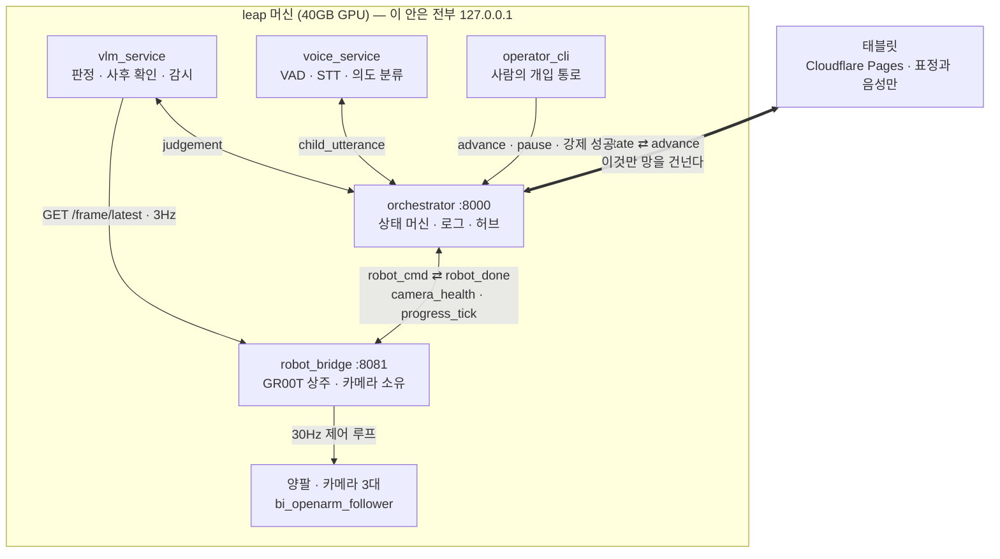
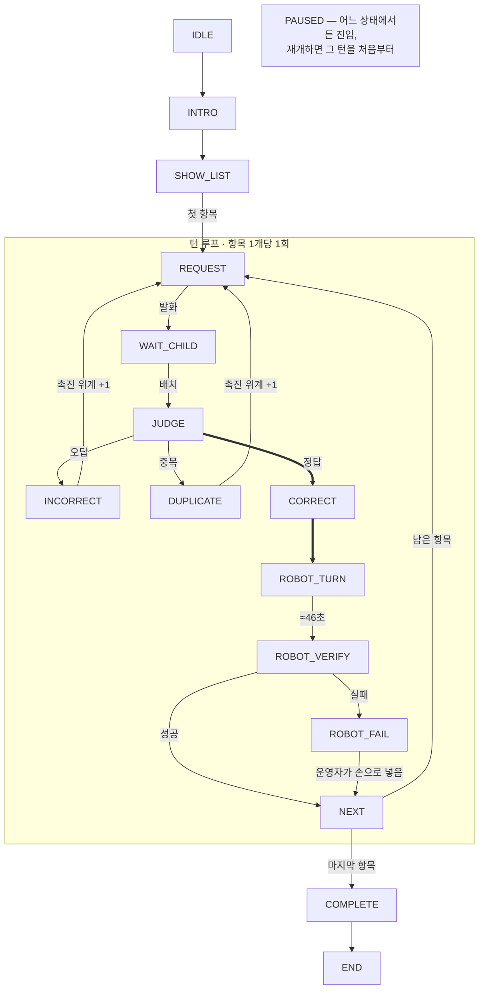
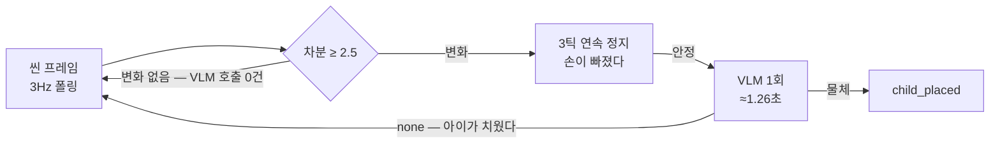

# 아키텍처 — 전체 구조

VLM 판정부터 GR00T 실행까지, 여섯 프로세스와 열여섯 상태가 어떻게 맞물리는지 한 번에 보는 문서다.
실측 상수와 미결 항목까지 여기 모은다.

- 웹 판(표·다이어그램 렌더링): <https://claude.ai/code/artifact/af21fdeb-8b59-4895-bc84-f66e70167ebc>
- 그 페이지의 소스: [`docs/architecture.html`](architecture.html) — 자족 HTML이며 아티팩트 재배포에 그대로 쓴다.
  **이 문서와 함께 갱신할 것.**
- 이벤트 단위 규약은 [`CONTRACT.md`](../CONTRACT.md)가 기준이다. 여기는 그 위의 조감도다.

| | |
|---|---|
| 프로세스 | 6 (전부 leap 머신) |
| 세션 상태 | 16 |
| 역할 | 7 · 타입으로 게이팅 |
| VLM 판정 실측 | 20/20 |
| 로봇 턴 | 46.3초 (데이터셋 평균) |
| 과제분석 지표 | 14/17 자동 수집 |

---

## 배치 — 허브 하나, 스포크 다섯, 경계선 하나

`orchestrator`가 세션 상태를 혼자 소유하고 나머지는 전부 스포크다. 스포크끼리는 말하지 않는다.

**움직이는 팔을 감독하는 경로는 전부 로컬이다.** `robot_cmd`, `camera_health`, `robot_abort`,
초당 세 번의 프레임 폴링까지 모두 `127.0.0.1`에서 일어난다. 터널이 끊기면 태블릿 화면이 멈출 뿐,
팔은 로컬 감독 아래 그대로 있다. 카메라를 직접 여는 프로세스는 `robot_bridge` 하나뿐이다.

| 프로세스 | 혼자 소유하는 것 | 발행 | 상태 |
|---|---|---|---|
| `orchestrator` :8000 | 세션 상태 전부. 타이머, 촉진 위계, JSONL 로그. I/O 없는 순수 함수 `(상태, 이벤트) → (상태, 효과)` | `state` · `robot_cmd` · `set_watch` · `set_listen` | 검증됨 |
| `robot_bridge` :8081 | GR00T 정책(기동 시 1회 로드, 상주). 카메라 3대. 매 틱 관절 봉투 검사 | `robot_done` · `progress_tick` · `camera_health` | ⚠️ 실물 미검증 |
| `vlm_service` | 판정 · 사후 확인 · 변화 감시. 소켓 두 개(`/ws/vlm`, `/ws/capture`) | `judgement` · `vlm_hold` · `child_placed` | 실측 20/20 |
| `voice_service` | 에너지 VAD(푸시투톡 없음), CLOVA STT, 규칙+퍼지 의도 분류 | `child_utterance` | ⚠️ 오디오 장치 미확인 |
| 태블릿 | 아무것도. 서버 상태를 그리고 오디오를 재생하는 **뷰**다 | `advance` | e2e 통과 |
| `operator_cli` | 사람. 모든 자동 경로의 폴백이자 최종 권한 | `advance` · `pause` · `robot_abort` | 검증됨 |

---

## 흐름 — 항목 하나가 통과하는 열여섯 개의 상태

**굵은 경로가 유일하게 로봇을 움직인다.** `CORRECT`를 거치지 않고 `ROBOT_TURN`에 도달하는 간선이 없다.
오답과 중복은 촉진 위계만 한 단 올리고 같은 요청으로 돌아가며, 로봇이 실패해도 운영자가 손으로 넣고
`NEXT`로 합류해 아이는 성공으로 끝낸다. **실패로 끝나는 경로가 없다.**

---

## 지각 — 변화가 없으면 호출도 없다

아이가 여러 번 물건을 올려놓는 상황에서 가장 위험한 실패는 무한 재판정이다. 오답 물건이 책상에 남아
있으면 `WAIT_CHILD`로 돌아올 때마다 같은 판정을 반복하게 된다. 값싼 프레임 차분을 게이트로 두면
이 문제가 **별도 코드 없이** 사라진다.

임계값 2.5는 측정해서 정한 값이다. 정지 장면의 차분 최댓값이 2.42였고 34프레임에서 오탐 0건이었다.
처음 잡았던 3.5는 노이즈 바닥과 너무 가까웠다. 세션당 VLM 호출은 8~12회 수준이고, 판정 결과는
캐시되어 `judge_request`가 같은 프레임을 두 번 찍지 않는다.

| 감시 모드 | 언제 | 무엇을 하나 |
|---|---|---|
| `judge` | `WAIT_CHILD` | 안정된 변화마다 한 번 호출. `none`이면 `child_placed`를 내지 않는다 |
| `guard` | `ROBOT_TURN` | 프레임 차분은 팔과 물건을 가르지 못한다 → **판정을 포기하고** 턴당 운영자 알림 1회. 이송 중 자동 중단은 물건을 떨어뜨린다 |
| `stall` | 20초 무변화 | 같은 요청 발화 재생 + 위계 상승. 사다리를 넘어 3회 더면 `stall_saturated`로 운영자 호출 |

---

## 안전 — 규약이 아니라 타입으로 막은 것들

아래 다섯은 코드 리뷰로 지키는 규칙이 아니다. 위반하려면 타입이나 프로세스 경계를 뚫어야 한다.

- **`ALLOWED_SENDERS`** — VLM은 로봇에게 말할 수 없다. 이벤트마다 허용 발신 역할이 `frozenset`으로
  박혀 있고 `robot_cmd`의 발신자 집합에 `Role.VLM`이 없다. 판정은 허브를 거쳐 상태 전이가 되어야만
  로봇에 닿는다.
- **순수 상태 머신** — I/O도 시계도 없다. 시각은 주입되고 반환값은 `(다음 상태, 효과 목록)`뿐이다.
  서버 없이 전 경로를 테스트할 수 있고, 로그를 그대로 재생해 사후 분석이 가능하다.
- **관절 봉투** — GR00T 전처리기가 min/max 정규화 뒤 `clip_outliers`로 조용히 잘라내므로, 봉투 밖
  상태가 **엉뚱한 동작으로 뭉개져** 들어간다. 매 틱(0.2초 스로틀) 16축을 검사하고 위반이면 즉시 중단.
  여유는 2°다 — 턴 시작의 `right_gripper`가 봉투 최솟값에서 0.16°밖에 안 남는다.
- **카메라 단일 소유** — 카메라를 여는 프로세스는 `robot_bridge` 하나. 한 대라도 빠지면
  `camera_health.all_ok=false`가 새 턴을 막는다.
- **고정 대본** — 17줄은 사전 렌더링된 파일이고 TTS를 거치지 않는다. 예측 가능성(TEACCH)이 흔들리지
  않고 `prompt_level` 로그가 무엇이 언제 나갔는지 정확히 보존한다. 실시간 합성은 잡담 응답에만.

---

## 상수 — 추정이 아니라 측정에서 나온 숫자들

| 값 | 숫자 | 어디서 나왔나 |
|---|---|---|
| 로봇 턴 길이 | 46.3초 | 60에피소드 평균 (중앙 45.9 · 최대 60.5). 30fps 텔레옵 녹화 시간 |
| `robot_deadline_ms` | 69,500 | 46.3 × 1.5. ⚠️ **미측정** — 실행은 추론 지연으로 최대 2배까지 늘 수 있다. 드라이런 벽시계 × 1.3으로 교체할 것 |
| 움직임 임계값 | 2.5 | 정지 장면 차분 최댓값 2.42, 34프레임 오탐 0건 |
| 관절 봉투 16축 | Δ 0.000000 | 체크포인트 `observation.state.min/max`와 소수점까지 일치 |
| 봉투 여유 | 2.0° | 턴 시작 `right_gripper`의 실측 여유 0.16°에서 역산 |
| 홈 포즈 검증 | — | ⚠️ **미측정** — 오른팔·그리퍼 `observation.state`가 새 봉투 안에 드는지 |
| 판정 정확도 | 20 / 20 | 새 씬 프레임, gpt-4o, 프롬프트 무수정 |
| 사후 확인 | 15 / 15 | 가림 규칙(`hidden`) 추가 후. 위험한 오답 0건 |
| 판정 지연 | 1.26초 | gpt-4o 중앙값. gemini는 같은 정확도에 4.10초 |
| `judge_timeout_ms` | 15,000 | 판정 실측 최대 14.1초 |
| `verify_timeout_ms` | 20,000 | 재시도 루프 최악 10.3초. 10초였을 때 **성공한 로봇이 실패 처리**됐다 |
| 턴 단계 경계 | 0.27 / 0.52 / 0.92 | 그리퍼 채널에서 뽑은 `opening → reaching → placing → closing` 시간 분포 |
| 세션당 API 비용 | $0.025 | gpt-4o, 3항목·12콜. 100세션 $2.46. 토큰 수는 실측, 단가는 확인 필요 |

---

## 음성 — 귀는 열고, 입은 고정한다

아이에게 버튼을 누르라고 요구하지 않는다. 에너지 VAD가 상시 듣고, 나온 말은 의도로 분류되어
**이미 존재하는 이벤트**에 매핑된다. 음성이 하나도 안 와도 세션은 완결된다 — 가산적으로 붙는 층이다.

| 아이가 한 말 | 의도 | 시스템이 하는 일 |
|---|---|---|
| "다시 말해줘", "뭐라고?" | `REPEAT_REQUEST` | 같은 요청 발화 재생. **촉진 위계는 올리지 않는다** — 못 들은 것과 모르는 것은 다르다 |
| "모르겠어" | `DONT_KNOW` | 위계 한 단 상승 (`verbal → hint → model`) |
| "그만", "쉬고 싶어" | `BREAK` | `PAUSED` 진입. 재개하면 그 턴을 처음부터 |
| "했어", 그 외 | `DONE` · `OTHER` | 로그만. 진행 신호로 쓰지 않는다 |

마이크 창은 상태 머신이 연다(`SetListen`, `WAIT_CHILD`에서만). 재프롬프트 중에는 닫아 에코를 막고
`WAIT_CHILD + advance`에서 다시 연다. 오디오 출력은 전부 태블릿의 사전 렌더링 wav이고, Chrome
자동재생 정책 때문에 **설정 화면의 탭 한 번**이 필수 제스처다.

46초 무발화 구간에는 `progress_tick`이 초당 한 번 `ratio`와 `turn_phase`를 실어 보낸다 —
태블릿은 스톱워치가 아니라 단계를 보여준다.

> 마이크를 leap 머신이 아니라 태블릿에 두는 방안은 [`docs/TABLET_MIC.md`](TABLET_MIC.md)에서 검토했다.

---

## 측정 — 과제분석 지표 17개 중 14개가 자동으로 쌓인다

초기 로그가 `%H:%M:%S` 초 해상도라 시간 기반 지표 5개가 통째로 무너져 있었다. 지금은 밀리초 ISO
타임스탬프에 세션 시작 기준 `t_ms` 오프셋이 함께 붙는다.

| 지표 | 어디서 나오나 |
|---|---|
| 탐색 시간 | `search_ms` — 요청 발화 종료부터 물건이 놓일 때까지. **VLM 지연을 분리했다**: 초기 구현은 판정 시간이 섞여 4.6초가 부풀려져 있었다. `judge_ms`는 따로 기록 |
| 촉진 횟수 | `prompt_given` 이벤트에 `prompt_level`. 위계별 분해가 사후에 가능하므로 촉진 위계를 유지하면서 "최소 오류 신호" 해석도 버리지 않는다 |
| 선택적 주의 | `on_target` — 호명된 바로 그 하나를 골랐는지. `strict_order: true`와 함께 오선택률 계산 |
| 재호명 횟수 | `child_utterance`의 `REPEAT_REQUEST` 카운트. 음성 층이 꺼져 있으면 이 지표만 비고 나머지는 그대로 |
| 나머지 3개 | 시선·정서·자발 발화의 질 — 자동 수집 대상이 아니다. 관찰자 기록 |

---

## 미결 — 시연 전에 사람이 해야 하는 것

| | 항목 | 내용 |
|---|---|---|
| 차단 | 홈 포즈 실측 | 오른팔 7축과 그리퍼가 새 봉투 안에 드는지. `right_gripper ≤ −17.3`, `right_joint_7 ≥ −6.6`. 벗어나면 preflight가 매 턴 추론을 막는다 |
| 차단 | 드라이런 1회 | 벽시계 턴 시간을 재서 `robot_deadline_ms`를 그 값 × 1.3으로 교체 |
| 필요 | 발화 파일 11개 | 재녹음 2건(`intro-4`, `outro-1` — 지퍼 문구 제거), 신규 9건. 지금은 자막만 나가고 2.2초 뒤 넘어간다 |
| 필요 | 정책 코드 백업 | `groot_frozen_bf16`이 leap 머신에만 있고 추적되지 않는다 |
| 대기 | 터널 기동 | `cloudflared` 설치와 `npm run deploy`. Cloudflare 로그인 필요. 실패하면 LAN 직결이 폴백 |
| 대기 | Ran의 판단 | 46.3초 × 3회의 무발화 구간이 상호작용으로 적정한가 |
